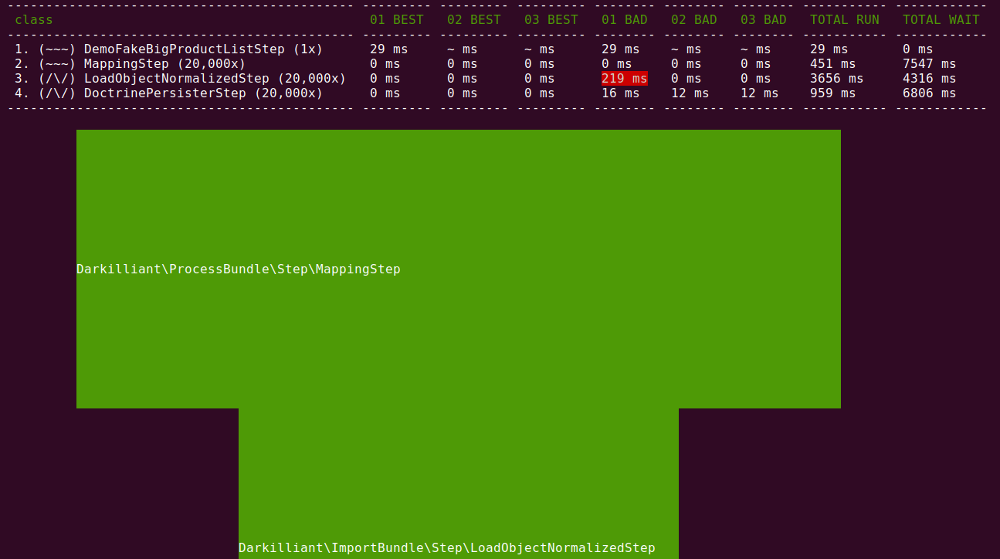

### Trouver les goulots d'étranglement

Il vous tous d'abord lancer le traitment avec l'option `--profiling`.

Example,<br>
```
$ bin/console process:run --profiling -- [nom_traitement]
```

Ensuite un fichier stat.json sera généré, celui-ci contient toute les métrics collecté.

Afin de les afficher sous forme de tableau et graphique,

```
$ bin/console process:stats
```

Ceci donnera par example la sortie suivante,<br>

Le tuyaux en dessous est composé de plusieurs partie réprésentant chacune une étape.<br>
Imaginer un flux d'eau couler dedans et vous trouverez où le flux se réduit, où il s'accumule et où il est toujours en attente<br>

Dans une version future, il sera possible de comparer deux profile afin de détecter une amélioration ou une dégration.<bt>


